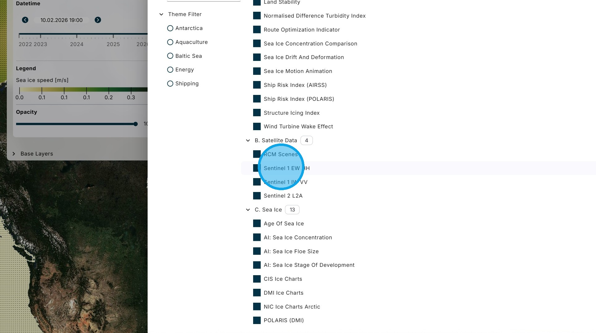
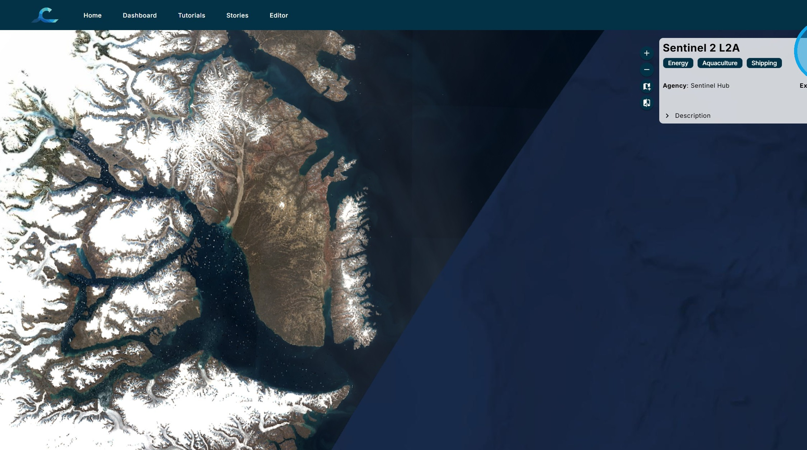
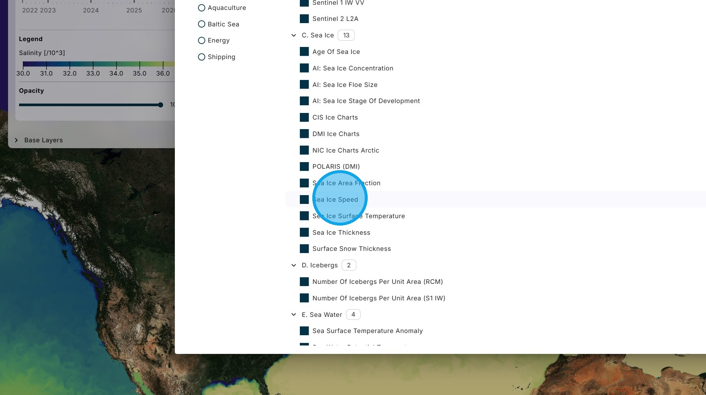
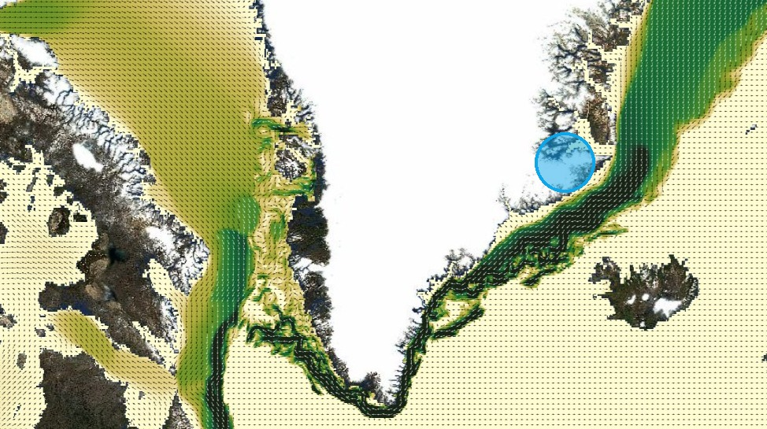
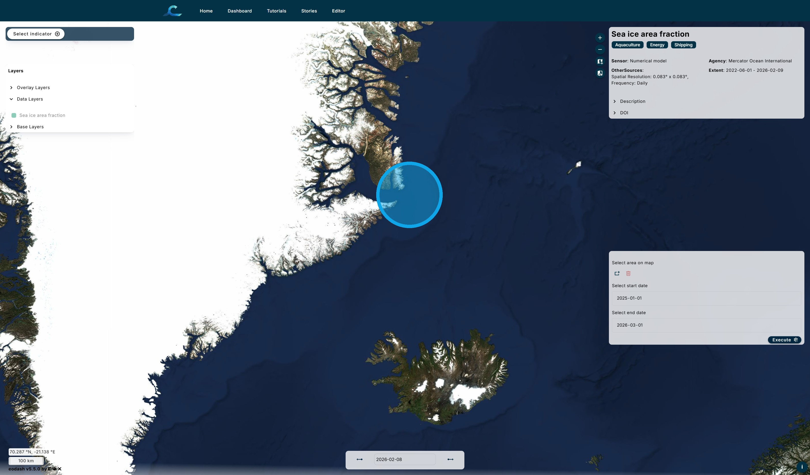
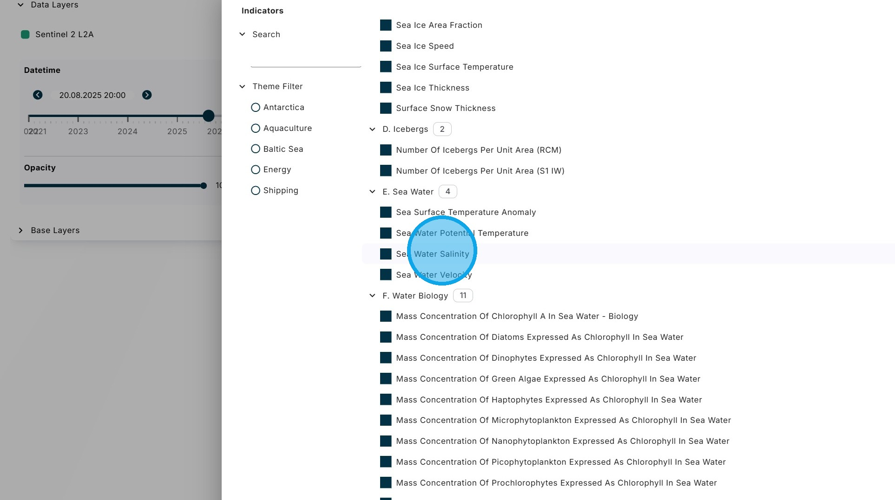
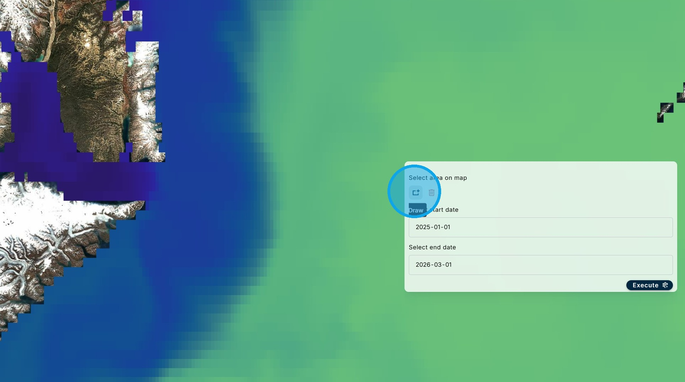
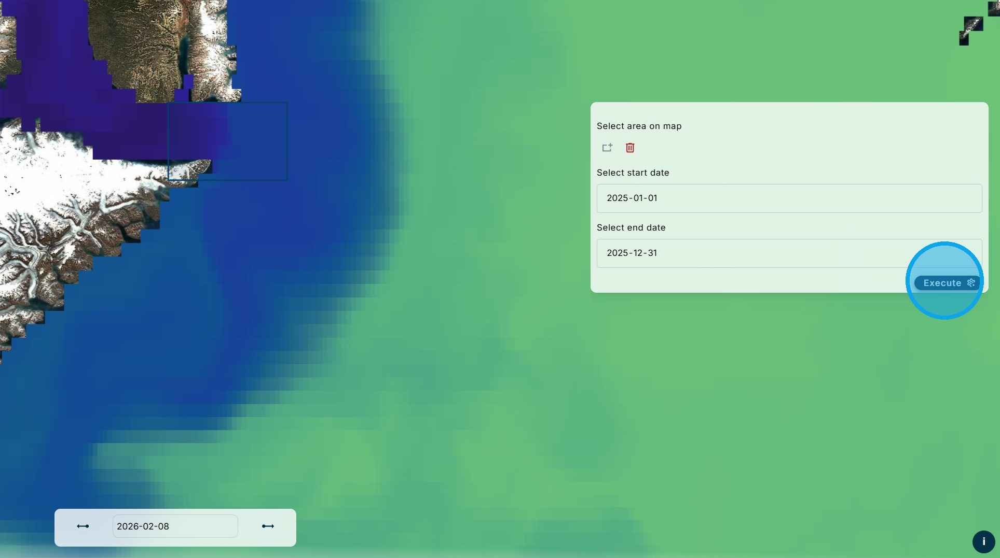
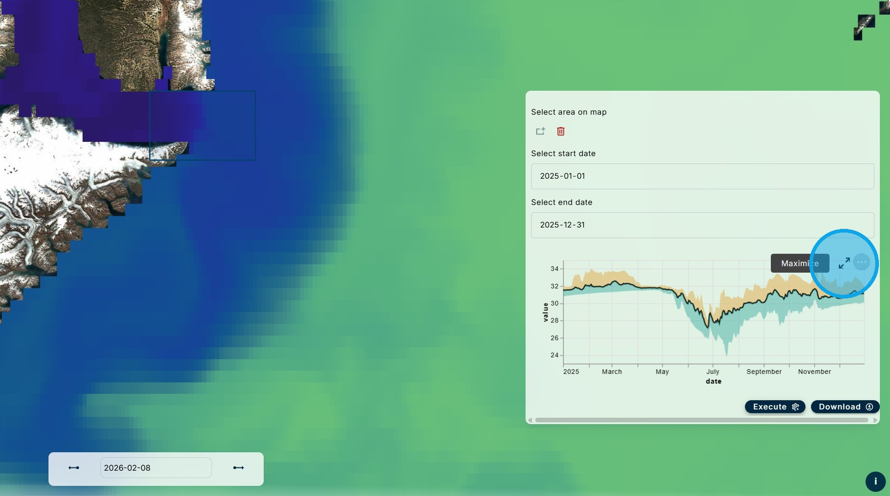
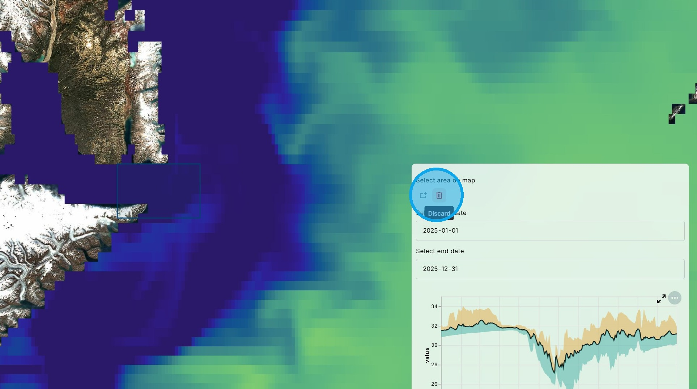

# B. Data Visualization and Analysis

The primary purpose of the CIF Dashboard is to allow users to visualize data and intereact with them. The data can come from external sources, from the CIF internal storage, or be calculated on-the-fly using parameters selected by users.

1\. Current CIF data holdings include:

- Satellite data
- Sea ice
- Icebergs
- Sea water
- Water biology
- Water chemistry
- Waves
- Wind
- Bathymetry

Most of the data is global, with a focus on the North Atlantic and Arctic oceans. There is also data specific to the Baltic Sea and Antarctica.

Most of the data can be analyzed statistically.

2\. There are a few types of satellite data available.

3\. Radarsat Constellation Mission (RCM) and Sentinel 1 are Synthetic Aperture Radar (SAR) satellites that can see in the dark and through clouds. For Sentinel 1, EW HH means Extra Wide swath mode and Horizontal polarization for both transmit and receive. IW VV means Interferometric Wide swath mode and Verticle polarization for both transmit and receive.

4\. Sentinel 2 is an optical satellite. L2A indicates the level of processing of the image.

5\. Sea Ice Speed is an example of vector data.

6\. Vector data is illustrated as a combination of a colour, indicating magnitude, and arrows, indicating direction.

7\. There are often a variety of approaches to get the same information. For example, sea ice concentration can be determined from passive microwave satellite data, by human analysts interpreting SAR satellite data (see various ice charts), and through artificial intelligence interpretation of SAR satellite data.

8\. Here is an example of sea ice concentration determined by AI interpretation of SAR satellite data.

9\. When data variables are suitable for statistical analysis, a menu box will appear in the bottom right corner. Here is an example of the statistical analysis capabilities of the CIF Dashboard.

Using the "Select Indictor" button, choose Sentinel 2 L2A satellite data.

Using the calendar at the bottom of the map, choose 20 August 2025.

Pan and zoom to the fiord on the east coast of Greenland shown below.

10\. In this image, glaciers flowing into the fiord can be clearly seen, along with the icebergs floating in the fiord that have calved off the glaciers.

11\. Next, use the "Select Indicator" button to choose "Sea Water Salinity" data.

12\. Use the "Select area on map" tool to draw a bounding box at the outlet of the fiords.

13\. Use the "Select start date" and "Select end date" boxes to choose one year's data from 1 January to 31 December 2025 and then click "Execute".

14\. After a short processing time, the statistical analysis results are shown in the window. The arrows at the top right of the graph can be used to enlarge it.

15\. The graph shows salinity over the area of the bounding box across time. The mean is the black line and the upper and lower bounds are shown in orange and blue, respectively. Hovering the cursor over the graph brings up a box showing the statistics for any time.

It can be seen that the salinity is lowest in July when the glacier melt is at its maximum and fresh water from the glaciers is flowing into the fiord.

16\. The process can be repeated for another area or time by using the "Delete" area button, drawing a new bounding box, adjusting the dates, and clicking "Execute" again.

 

Return to the [Dashboard](https://cif.eox.at/uc1dashboard);

Return to the [Tutorial Contents](https://cif.eox.at/tutorials/);

Continue to the next Tutorial, [Structure Icing Index](https://cif.eox.at/tutorials/structure_icing);