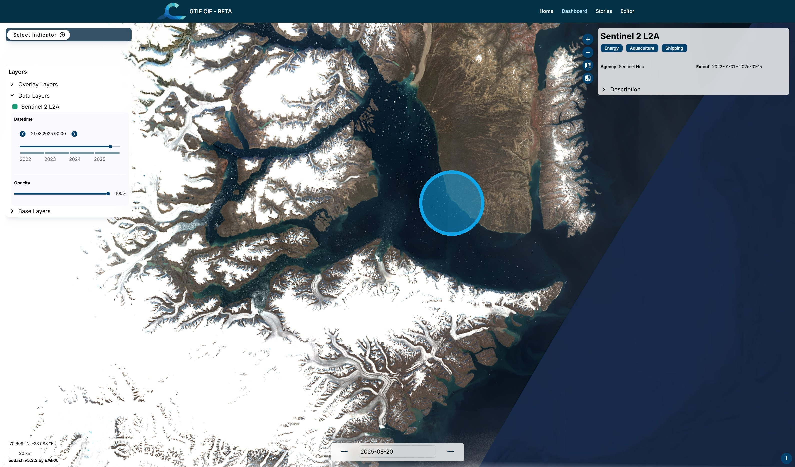
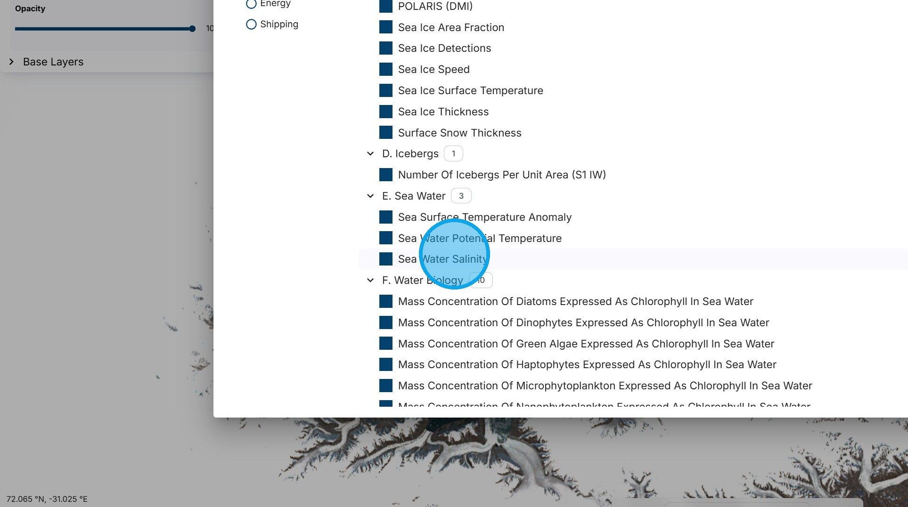
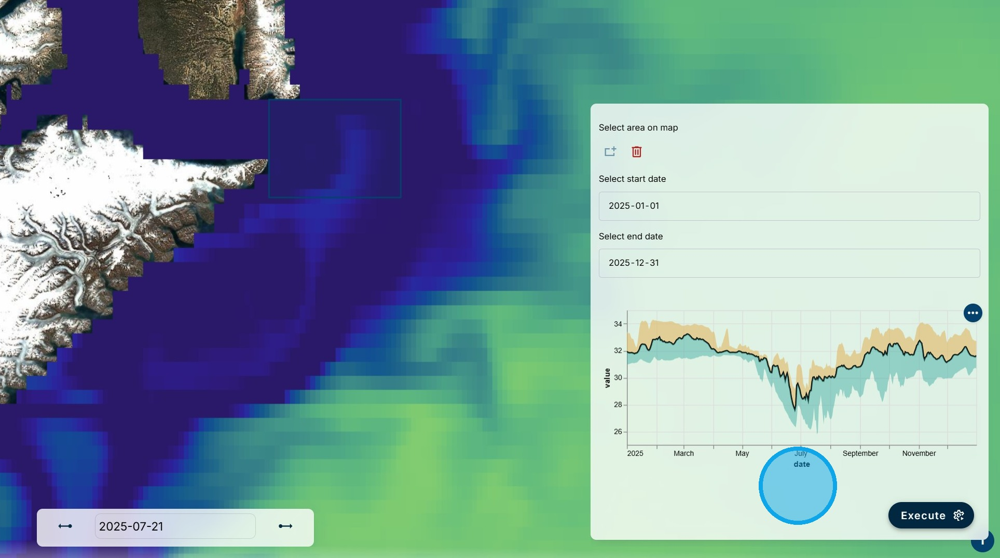
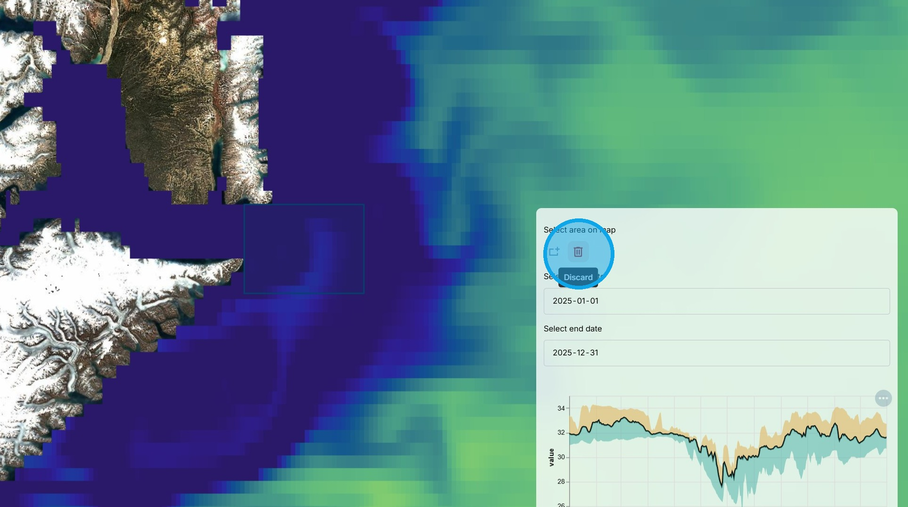

# Data Visualization and Analysis

This capability allows a wide variety of datasets to be visualized and analyzed at different times and regions of interest.

1\. We will now illustrate the statistical analysis capabilities of the CIF Dashboard.

First, we will look at a fiord on the east coast of Greenland.

2\. Using the "Select Indictor" button, we access a Sentinel 2 image from 21 August 2025. In this image, glaciers flowing into the fiord can be clearly seen, along with the icebergs floating in the fiord that have calved off the glacier.

3\. Next, we use the "Select Indicator" button to choose "Sea Water Salinity" data.

4\. We use the "Select area on map" tool to draw a bounding box at the outlet of the fiords.

5\. We then use the "Select start date" and "Select end date" boxes to choose one year's data from 1 January to 31 December 2025 and then click on the "Execute" button.

6\. After a short processing time, the statistical analysis results are shown in the window. The graph shows salinity over the area of the bounding box across time. The mean is the black line and the upper and lower bounds are shown in orange and blue, respectively. It can be seen that the salinity is lowest in July when the glacier melt is at its maximum and fresh water from the glaciers is flowing into the fiord.

7\. The process can be repeated for another area by using the "Delete" area button, drawing a new bounding box, and clicking on "Execute" again.

