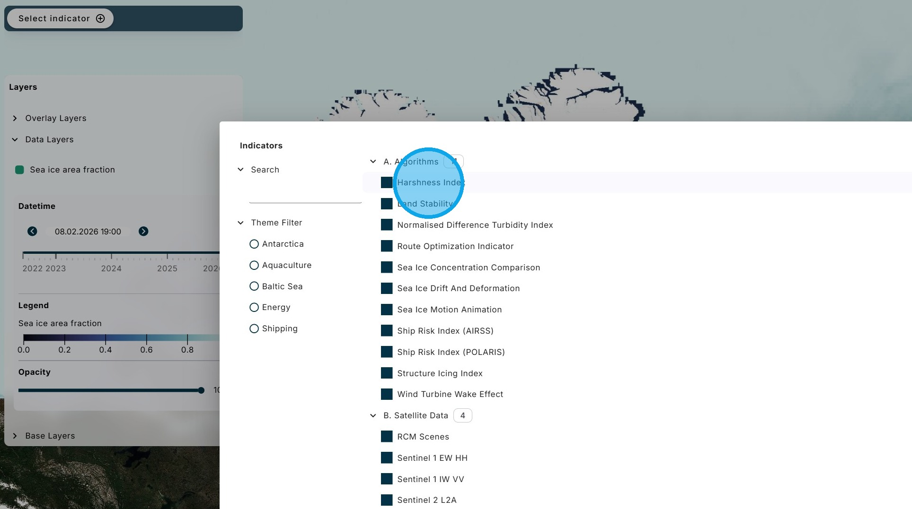
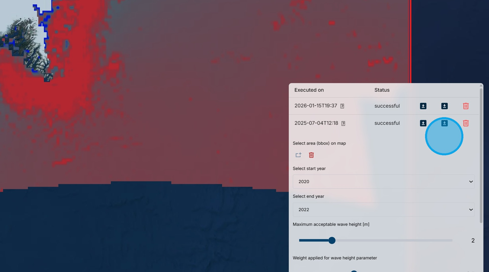

# D. Harshness Index

The Harshness Index algorithm generates maps of the relative harshness of condictions in a region based on wave height, sea ice concentration, and iceberg density data. The user can set the magnitude of each variable that is considered "harsh" and the weight that is given to the variable.

1\. Using the "Select Indicator" menu, select the "Harshness Index" algorithm.

2\. Using the "Select area" tool, draw a bounding box for the region of interest.

3\. In this example, we have drawn to box around the southern end of Greenland.

4\. Using the "Select start year" and "Select end year" boxes, choose the range of historical data for the analysis.

5\. Using the sliders, select the maximum acceptable value for each variable, and the weight to be given that variable relative to the others. 

Click "Execute".

6\. After a period of processing, the results are displayed on the map.

7\. The slider under the legend can be used to adjust the relative colour scale to better highlight the differences within the results.

8\. Since it takes some time for the results to be processed, they are stored for future access. For each stored run there is information on the date of execution and whether the run was successful or failed. There are options to load the results on the map, download the results, or delete the run.

9\. Clicking on the question mark icon beside the execution date opens the metadata for the run.

10\. Return to the Dashboard &lt;Link&gt;

Return to the Tutorial Contents &lt;Link&gt;

Continue to the next Tutorial &lt;Link&gt;