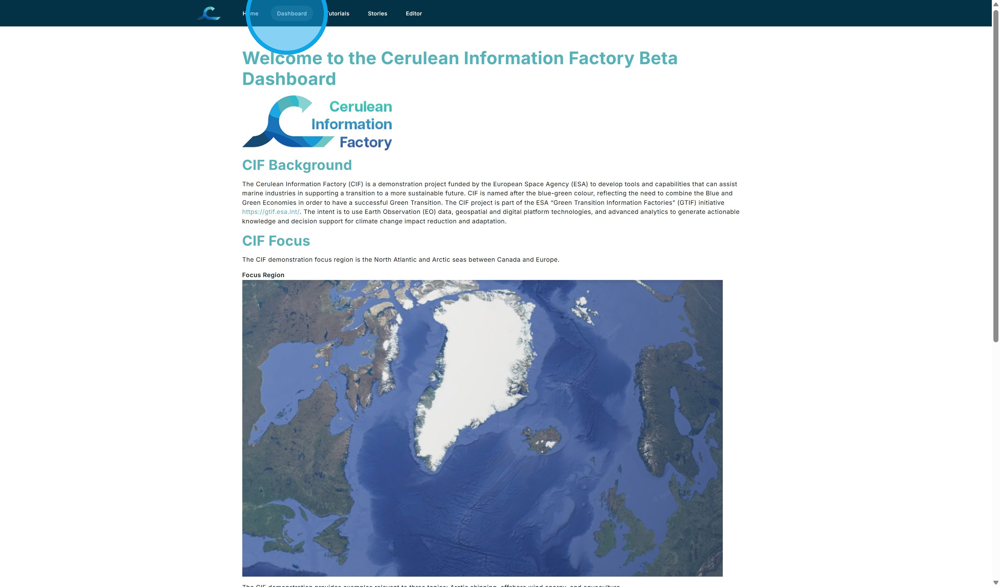
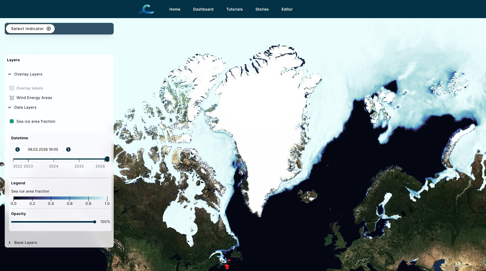
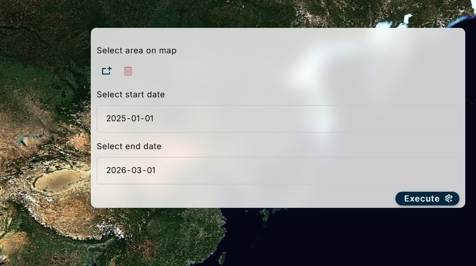
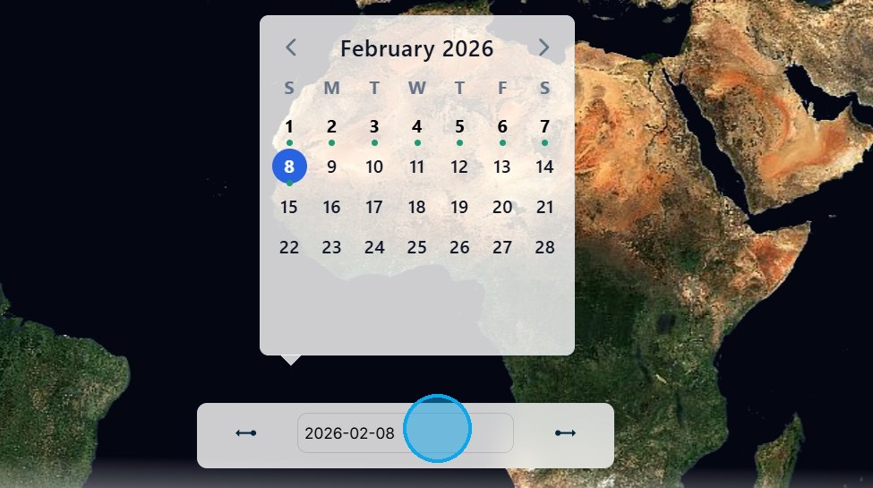

# A. Introduction to the CIF Dashboard

The Cerulean Information Factory (CIF) is a demonstration project funded by the European Space Agency (ESA) to develop tools and capabilities that can assist marine industries in supporting a transition to a more sustainable future. The CIF demonstration focus region is the North Atlantic and Arctic Oceans between Canada and Europe. The CIF demonstration provides examples relevant to three topics: Arctic shipping, offshore wind energy, and aquaculture.

1\. To begin, navigate to <https://cif.eox.at/>

The CIF Home Page provides background information about the Cerulean Information Factory project. The menu at the top provides links back to the Home Page, to the CIF Dashboard, to CIF Stories, and to the Tutorial Pages. 

Click on "Dashboard" in the top menu.

2\. The CIF Dashboard begins with a map. The map can be populated with information chosen from the "Select Indicator" menu at the top left. 

Click "Select Indicator".

3\. This menu provides access to a wide range of data variables and algorithms that process data to derive information.

The options can be filtered using a search function or the Theme Filter. In this example, the search term "sea ice" and the theme "Shipping" have been used as filters to reduce the number of capabilities and data variables offered.

Next, the "Sea Ice Area Fraction" data variable will be used to illustrate components of the dashboard. 

Click on "Sea Ice Area Fraction".

4\. This is an overview of a typical Dashboard data variable visualisation. 

The panel at the left provides the legend and date of the data variable currently being viewed. It also provides access to overlay and base data layers. 

The panel at the upper right contains the metadata for the data variable. 

The panel at the lower right is the user interface for manipulation of the data variable or algorithm. 

The box at the centre bottom is an expandable calendar. 

The boxes at the lower left show the coordinates of the cursor position and the scale of the current zoom level. 

Each of the panels will now be looked at in more detail.

5\. The Left Panel shows the Overlay Layers, Data Layers, and Base Layers.

In this example, the "Wind Energy Areas" of the Overlay Layers has been selected and is visable as the red polygons near Nova Scotia at the bottom centre of the map.

The Data Layers section of the panel shows the current date selected, the legend for the variable, and the current opacity of the layer. The date and opacity can be manipulated using the slider bars.

6\. The Top Right Panel shows the metadata for the selected data variable or algorithm. 

The information varies by data variable, but typically consists of the variable title, the applicable themes (highlighted under the title), the sensor used, the agency providing the data or algorithm, the frequency of acquistions, the geospatial resolution, the time extent of the data available, a description, and a link or DOI for further information.

7\. The Bottom Right Panel contains the user interface for statistics or algorithms that can be manipulated by the user. There are separate tutorials for each of the algorithms.

8\. The Bottom Panel contains a dropdown calendar that shows when data is available (in this case, shown as green dots) and allows data from those dates to be selected.

 

Return to the [Dashboard](https://cif.eox.at/uc1dashboard);

Return to the [Tutorial Contents](https://cif.eox.at/tutorials/);

Continue to the next Tutorial, [Data Visualization and Analysis](https://cif.eox.at/tutorials/data_visualisation);
