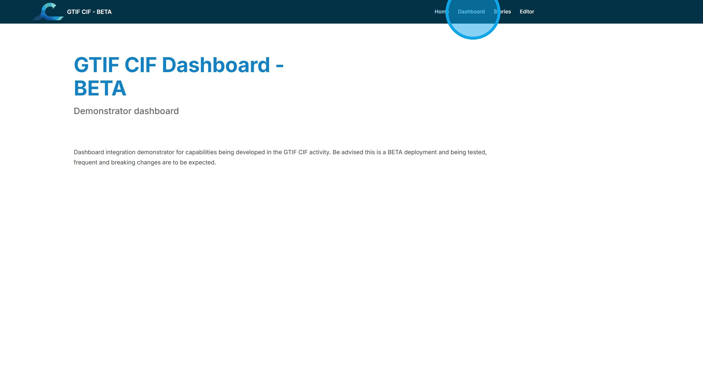
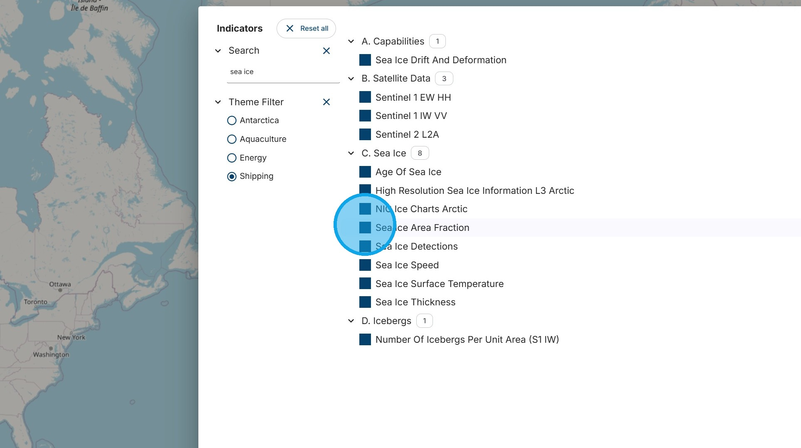
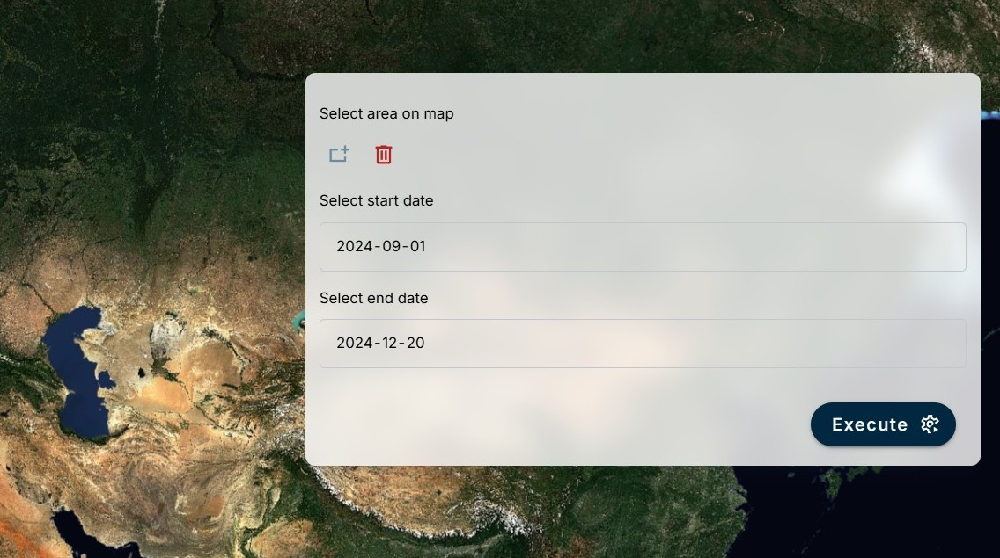

# Introduction to the CIF Dashboard

1\. Navigate to <https://cif.eox.at/>

2\. The CIF Home Page provides background information about the Cerulean Information Factory project. The menu at the top right provides links back to the Home Page, to the CIF Dashboard, to CIF Stories, to the CIF Story Editor, and to the Help Pages. Each of these options is described in separate tutorials accessible from the Help Pages. We will start with the CIF Dashboard. Click "Dashboard"

3\. The CIF Dashboard begins with a map. The map can be populated with information chosen from the Select Indicator menu at the top left. Click "Select Indicator"

4\. This menu provides access to a wide range of Capabilities (algorithms that process data to derive information) and data variables.

The options can be filtered using a search function or the Theme Filter. In this example, the search term "sea ice" and the theme "Shipping" have been used as a filters to reduce the number of capabilities and data variables offered.

Next, the "Sea Ice Area Fraction" data variable will be used to illustrate components of the dashboard. Click "Sea Ice Area Fraction".

5\. This is an overview of a typical Dashboard data variable visualisation. The panel at the left provides the legend and date of the variable currently being viewed. It also provides access to overlay and base data layers. The panel at the upper right contains the metadata for the variable. The panel at the lower right is the user interface to manipulate the variable or capability. The box at the centre bottom is an expandable calendar that shows when data is available. The boxes at the lower left show the coordinates of the cursor position and the scale of the current zoom level. Each of the panels will now be looked at in more detail.

6\. The Left Panel shows the Overlay Layers, Data Layers, and Base Layers.

In the this example, the "Wind Energy Areas" of the Overlay Layers has been selected and is visable as the red polygons near Nova Scotia at the bottom centre of the map.

The Data Layers section of the panel shows the current date selected, the legend for the variable, and the current opacity of the layer. The date and opacity can be manipulated using the slider bars.

7\. The Top Right Panel shows the metadata for the selected variable or capacity. The information varies by variable, but typically consists of the variable title, the applicable themes (highlighted under the title), the sensor used, the agency providing the data or algorithm, the frequency of acquistions, the geospatial resolution, the time extent of the data available, a description, and a link or DOI to further information.

8\. The Bottom Right Panel contains the user interface for data or capability that can be manipulated by the user. There are separate tutorials for each of these.

9\. The Bottom Panel contains a dropdown calendar that shows when data is available (in this case, shown as green dots) and allows data from those dates to be selected.

10\. Return to the Dashboard

Return to the Tutorial Contents

Continue to the next Tutorial