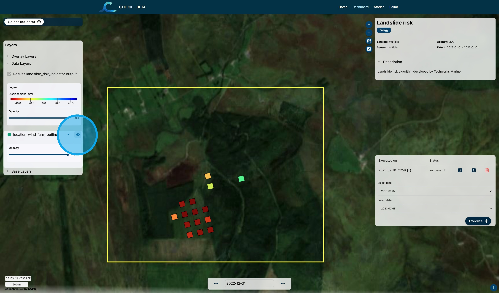

# H. Land Stability

The Land Stability algorithm uses Interferometric SAR (InSAR) techniques to determine whether the stability of peat bogland is suitable for windfarm development.
Millimetre-sized changes can be tracked using InSAR by studying the same area at two different time points. Areas exhibiting larger changes over time are deemed to be at higher risk of instability.

1\. Using the "Select Indicator" menu, select the "Land Stability" algorithm.

2\. For the demonstration version of the CIF Dashboard, the Landslide Risk algorithm is restricted to one location in Ireland.

Using the two "Select date" boxes choose the dates to be compared for the analysis.

Click "Execute".

3\. After a period of processing, the results are displayed on the map.

The legend is shown in the panel on the left.

The bounding box for the analysis is shown in yellow. It can be toggled on and off using the "eye" icon in the legend panel.

4\. Since it takes some time for the results to be processed, they are stored for future access. For each stored run there is information on the date of execution and whether the run was successful or failed. There are options to load the results on the map, download the results, or delete the run.

5\. Clicking on the question mark icon beside the execution date opens the metadata for the run.

 

Return to the [Dashboard](https://cif.eox.at/uc1dashboard);

Return to the [Tutorial Contents](https://cif.eox.at/tutorials/);

Continue to the next Tutorial, [Normalised Difference Turbulence Index](https://cif.eox.at/tutorials/normalise_difference_turbidity);