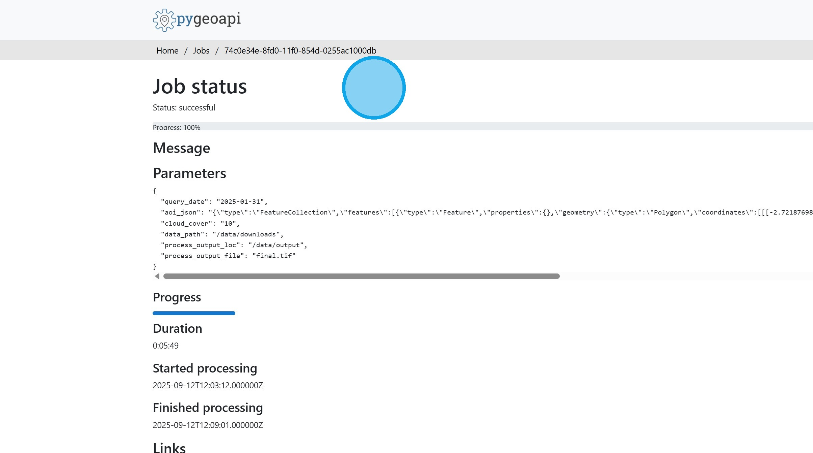

# I. Normalised Difference Turbidity Index

Offshore wind farms require power cables to be connected to a grid point onshore. These power cables are buried in the seabed:
- To prevent cable damage from storms and in-water activities occurring above the cables.
- To minimise wear to the cables.
- To minimise disruption to plant and animal life on the seabed (post-burial).
The Normalised Difference Turbidity Index provides an indication of the rate of subsurface erosion.

1\. From the "Select Indicator" menu choose the "Normalised Difference Turbidity Index" algorithm.

2\. Using the calander box, select the date for the analyis.

3\. Zoom and pan to the area of interest. The Sentinel 2 image for the date and place is shown.

Use the "Select area" tool to draw a bounding box for the analysis. 

Click "Execute".

4\. Once the processing is finished, the results are shown on the map.

5\. Since it takes some time for the results to be processed, they are stored for future access. For each stored run there is information on the date of execution and whether the run was successful or failed. There are options to load the results on the map, download the results, or delete the run.

6\. Clicking on the question mark icon beside the execution date opens the metadata for the run.

7\. Return to the Dashboard &lt;Link&gt;

Return to the Tutorial Contents &lt;Link&gt;

Continue to the next Tutorial &lt;Link&gt;