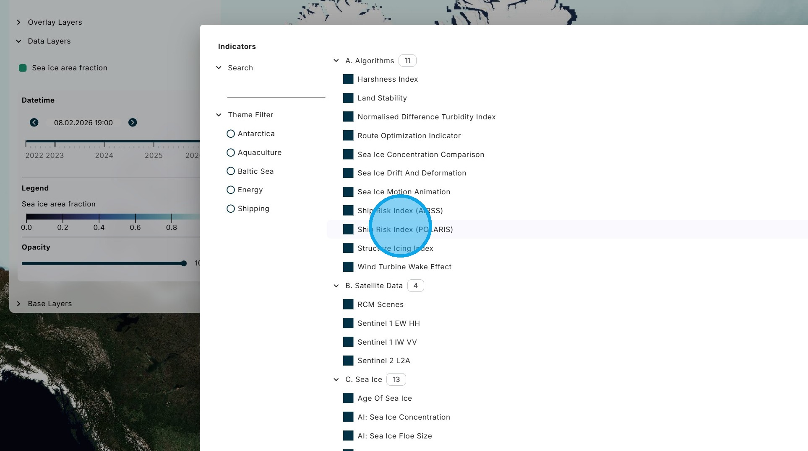
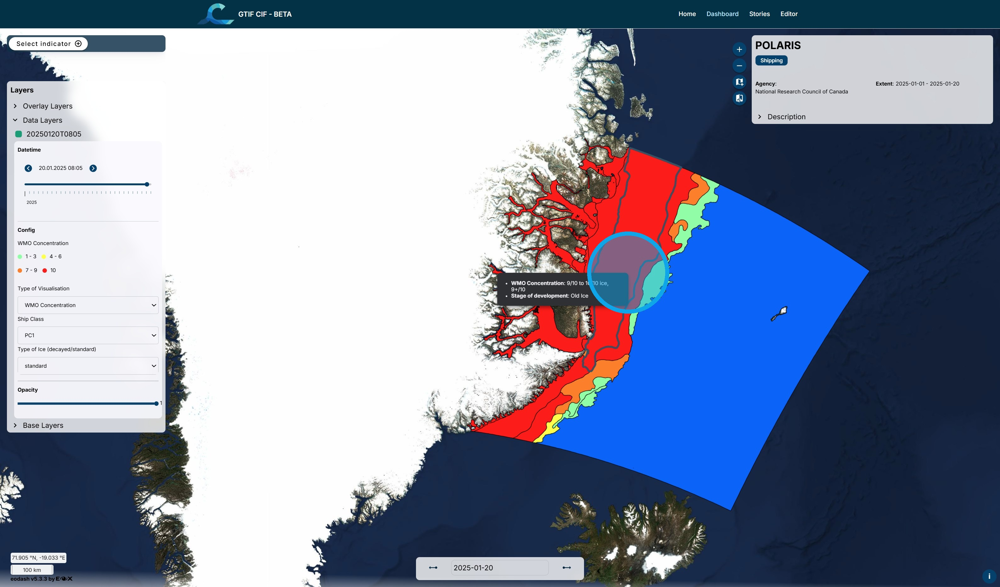
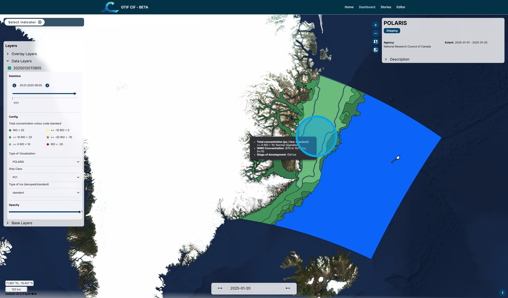

# E. POLARIS Ship Risk Index

The Polar Operational Limit Assessment Risk Indexing System (POLARIS) is a methodology to assess the risk posed to a ship by ice conditions in relation to the ship's assigned ice class. It uses the WMO standard sea ice charts as the basis for the calculation.

1\. Using the "Select Indicator" menu, select the "Ship Risk Index (POLARIS)" algorithm.

2\. Select the date of the ice chart from the calendar box.

3\. When there is more than one ice chart in a day, the selection can be fine-tuned using the date bar in the legend panel.

4\. The "Type of Visualisation" box allows the layers within the ice chart to be chosen. There are three layers: 1. Ice Concentration, 2. Stage of Development, and 3. POLARIS RIO. The POLARIS risk index outcome (RIO) calculation uses the ice concentration and stage of development as inputs.

5\. Here are the ice concentration results. The legend shows the colour codes and the information for the layers can also be seen by hovering the cursor over each polygon.

6\. Here are the stage of development results.

7\. Here are the POLARIS RIO calculation results. The RIO values are all low because the ship is a Polar Class 1 icebreaker, the most capable level.

8\. Here the class has been changed to NIS - not ice strengthened - and the risk has increased significantly.

9\. The ice conditions can be changed between winter ice and decaying summer ice.

 

Return to the [Dashboard](https://cif.eox.at/uc1dashboard);

Return to the [Tutorial Contents](https://cif.eox.at/tutorials/);

Continue to the next Tutorial, [Sea Ice Motion Animation](https://cif.eox.at/tutorials/polarwarp);