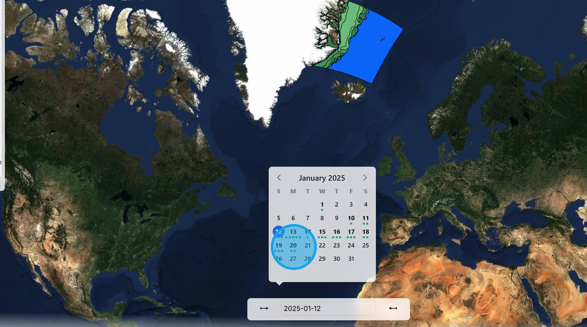

# POLARIS Indicator

The Polar Operational Limit Assessment Risk Indexing System (POLARIS) is a methodology to assess the risk posed to a ship by ice conditions in relation to the ship's assigned ice class. It uses the WMO standard sea ice charts as the basis for the calculation.

1\. Using the "Select Indicator" menu, select the "POLARIS" capability.

2\. Select the date of the ice chart from the calendar box. In this case, we have chosen 20 January 2025.

3\. When there is more than one ice chart in a day, the selection can be fine-tuned using the date bar in the legend panel.

4\. The "Type of Visualisation" box allows the layers within the ice chart to be chosen. There are three layers: 1. Ice Concentration, 2. Stage of Development, and 3. POLARIS RIO. The POLARIS risk index outcome (RIO) calculation uses the ice concentration and stage of development as inputs.

5\. Here are the ice concentration results. The legend shows the colour codes and the information for the layers can also be seen by hovering the cursor over each polygon.

6\. Here are the stage of development results.

7\. Here are the POLARIS RIO calculation results. The RIO values are all low because the ship is a Polar Class 1 icebreaker, the most capable level.

8\. Here the class has been changed to NIS - not ice strengthened - and the risk has increased significantly.

9\. There is also the possiblity to changed between winter ice and decaying summer ice.

