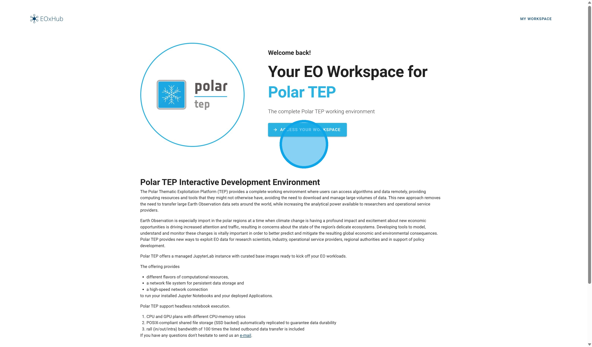
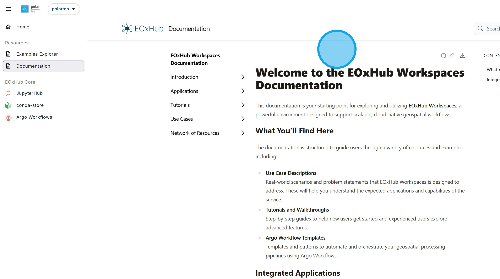
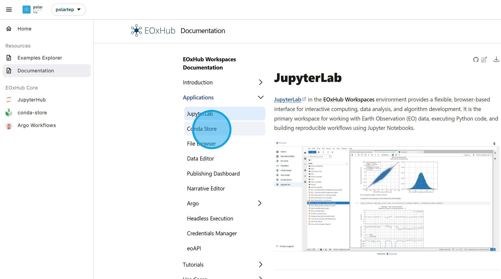
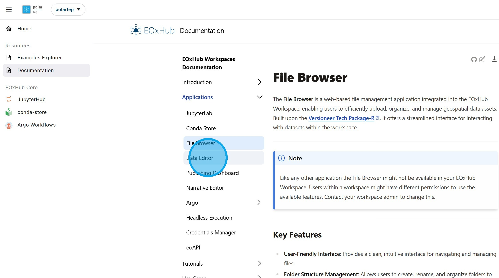
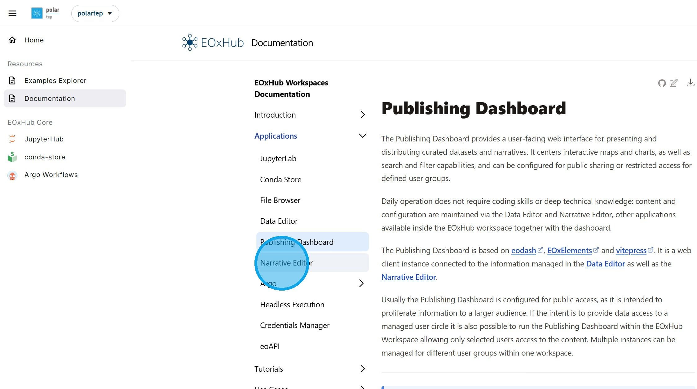
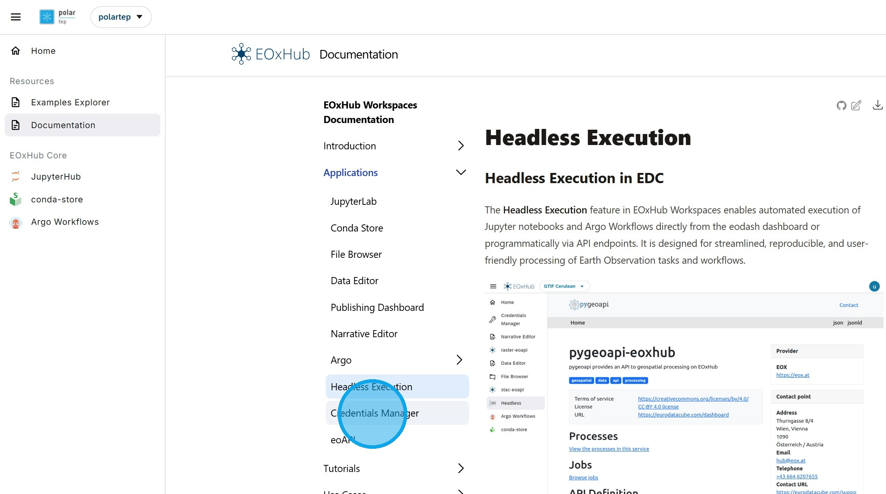

# L. Polar TEP Workspaces

Polar TEP workspaces are part of the CIF ecosystem, providing capabilities for more powerful analysis by users who are comfortable in a cloud computing environment. A workspace provides:
- Data access
- Application development
- Execution environment
- Data storage and management

1\. Polar TEP workspaces can be accessed [here](https://polartep.hub.eox.at)

2\. The resources available to a user are shown in the menu on the left hand side. Those resources will be customized to each user and may not include all those shown in the following slides.

3\. All users will have acces to the Example Notebooks.

4\. All user will have access to the Documentation. The documentation is structured to guide users through a variety of resources and examples.

5\. All users will have access to Jupyter Lab, a flexible, browser-based interface for interactive computing, data analysis, and algorithm development. It is the primary workspace for working with Earth Observation (EO) data, executing Python code, and building reproducible workflows using Jupyter Notebooks.

6\. All users will have access to the Conda Store, which enables users to define and manage reproducible Python environments. This ensures consistent execution across sessions and allows developers to control the underlying libraries and dependencies for their workflows.

7\. All users will have access to Argo Workflows, a workflow orchestration tool, providing a solution for defining and executing multi-step processing pipelines where each step runs in its own container.

This enables scalable and repeatable execution of applications, supporting both simple tasks and complex, long-running jobs.

A web-based workflow editor provides an intuitive interface to design, manage, and visualize workflows.

8\. Users may have access to the File Browser, a web-based file management application enabling users to efficiently upload, organize, and manage geospatial data assets.

9\. Users may have access to the Data Editor, which provides a traceable review and approval path of collection configurations before data is published to the configured STAC catalog.

10\. Users may have access to the Publishing Dashboard, a user-facing web interface for presenting and distributing curated datasets and narratives. It centers interactive maps and charts, as well as search and filter capabilities, and can be configured for public sharing or restricted access for defined user groups.

The Cerulean Information Factory (CIF) interface is an example of a Dashboard.

11\. Users may have access to the Narrative Editor, a content editor for creating and publishing structured narratives combined with Earth Observation (EO) content called 'stories'.

The Cerulean Information Factory (CIF) Dashboard contains example [stories](https://cif.eox.at/storyviewer/).

More information on the Narrative Editor is available in a separate [tutorial](https://documentation.hub.eox.at/narrative-editor-1/).

12\. Users may have access to the Headless Execution capability, enables automated execution of Jupyter notebooks and Argo Workflows directly from the eodash dashboard or programmatically via API endpoints. It is designed for streamlined, reproducible, and user-friendly processing of Earth Observation tasks and workflows.

13\. Users may have access to the Credentials Manager, which allows Workspace secrets—such as API tokens, database credentials, or service keys—to be securely managed and ensures sensitive information is not hard-coded in notebooks, workflows, or shared files.

14\. Users may have access to the eoAPI that provides data visualization capabilities for both raster and vector data. These are powered by titiler-pgstac and PgSTAC, which together enable dynamic tiling and rendering of STAC-compliant assets directly from storage based on pre-defined collection-level metadata fields.

It exposes a FastAPI based interface, supporting image formats such as PNG and JPEG, and standard interfaces like WMTS.

 

Return to the [Dashboard](https://cif.eox.at/uc1dashboard);

Return to the [Tutorial Contents](https://cif.eox.at/tutorials/);

Continue to the next Tutorial, [Narrative Workspace](https://cif.eox.at/tutorials/narrative_editor);