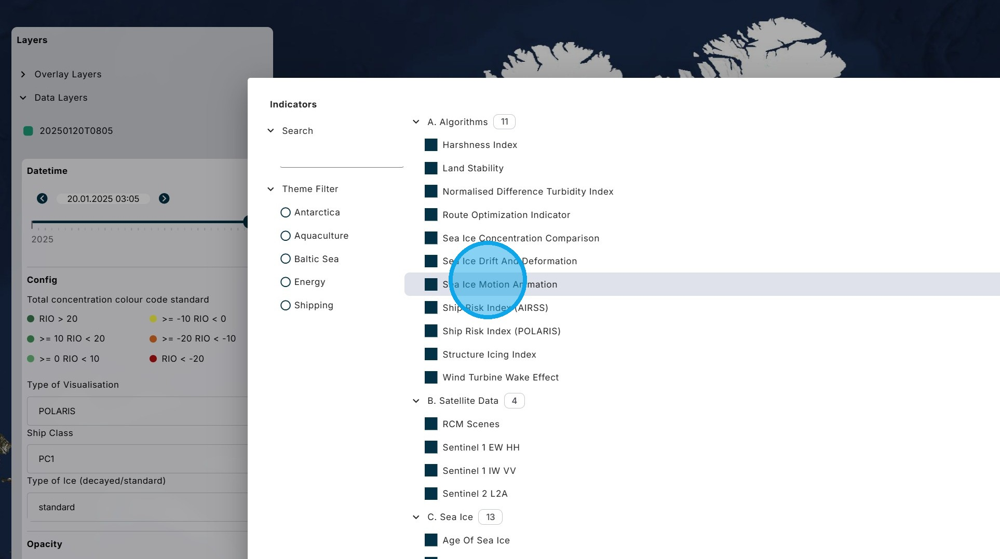
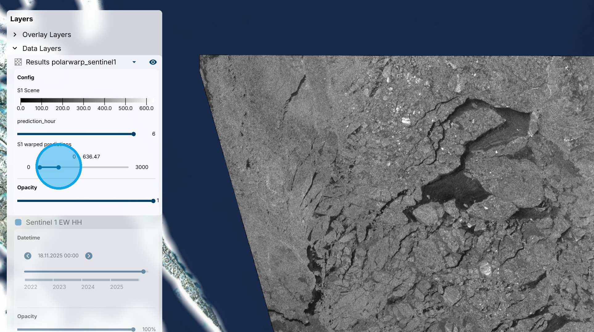
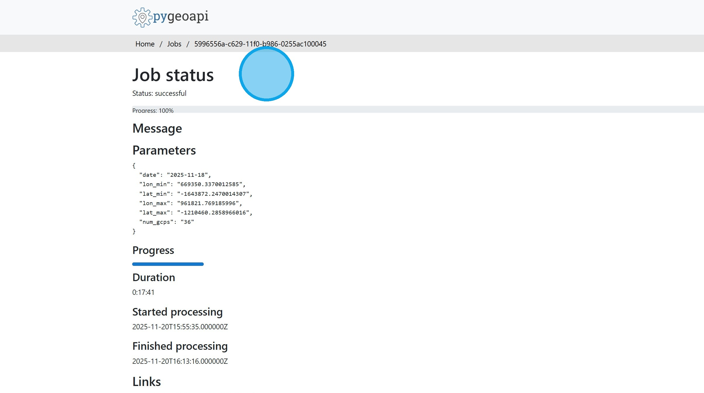

# F. Sea Ice Motion Animation

There can be a long wait for the next satellite image to be received during which sea ice can move a considerable distance. The Sea Ice Motion Animation algorithm transforms the current satellite image using a sea ice drift forecast to simulate what the ice in a region should look like in the future.

1\. Using the "Select Indicator" menu, select the "Sea Ice Motion Animation" algorithm.

2\. Zoom into the area of interest until the Sentinel 1 data begins to load.

3\. Using the calendar box, select a date for the analysis.

4\. Using the "Select area" tool, draw a bounding box for the region of interest. 

Select the start date for the analyis in the box. 

Select the number of Ground Control Points (GCPs) to use. A higher number gives better results, but greatly increases the processing time. 

Click "Execute".

5\. Use the "eye" icon to turn off the underlying Sentinel 1 layer.

6\. The slider bar under the legend can be used to step through the results in increments of an hour. At each step, the image will change to reflect the predicted impact of the forecasted ice drift.

7\. The next slider bar under the legend can be used to change the brightness of the image to optimize the details that can be seen in the ice.

8\. Since it takes some time for the results to be processed, they are stored for future access. For each stored run there is information on the date of execution and whether the run was successful or failed. There are options to load the results on the map, download the results, or delete the run.

9\. Clicking on the question mark icon beside the execution date opens the metadata for the run.

 

Return to the [Dashboard](https://cif.eox.at/uc1dashboard);

Return to the [Tutorial Contents](https://cif.eox.at/tutorials/);

Continue to the next Tutorial, [Wind Turbine Wake Effect](https://cif.eox.at/tutorials/wind_turbine_wake_effect);