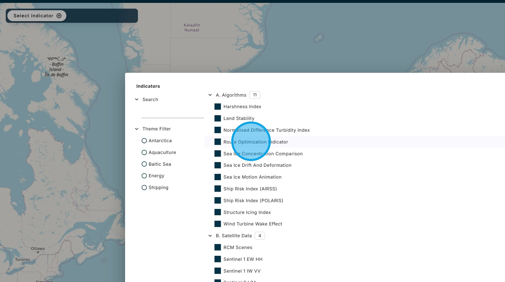
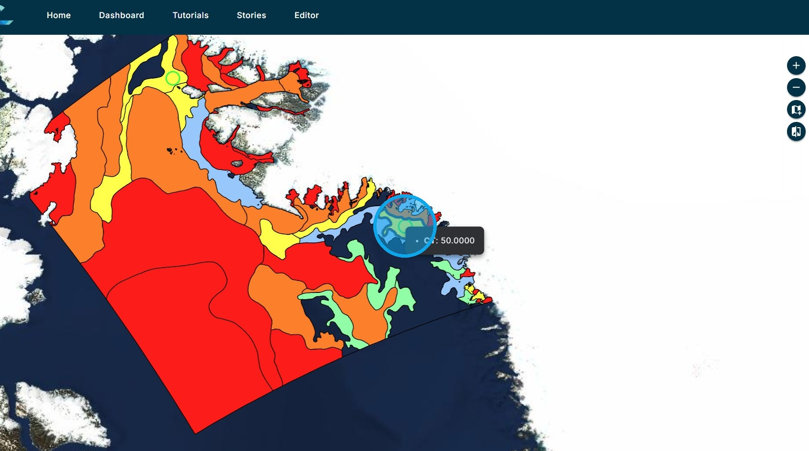
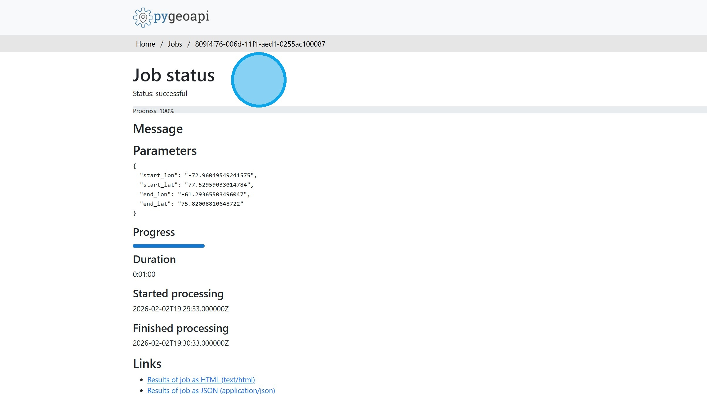

# J. Route Optimization

The Route Optimization algorithm calculates the optimal route between two points that minimizes transit time and fuel consumption, while ensuring the voyage is safe given the ice conditions and ice class of the ship. The ice conditions are obtained from the relevant sea ice chart and the risk to the ship is calculated using the POLARIS algorithm.

1\. From the "Select Indicator" menu choose the "Route Optimization" algorithm.

2\. For the demonstration version of the CIF Dashboard, the Route Optimization algorithm is restricted to one ice chart.

Use the start and end point selection tool ...

3\. ... to choose the start and end point within the ice chart. 

Click "Execute".

4\. One the processing is finished, the optimal route is displayed on the map as a red line.

5\. Since it takes some time for the results to be processed, they are stored for future access. For each stored run there is information on the date of execution and whether the run was successful or failed. There are options to load the results on the map, download the results, or delete the run.

6\. Clicking on the question mark icon beside the execution date opens the metadata for the run.

7\. Return to the Dashboard &lt;Link&gt;

Return to the Tutorial Contents &lt;Link&gt;

Continue to the next Tutorial &lt;Link&gt;