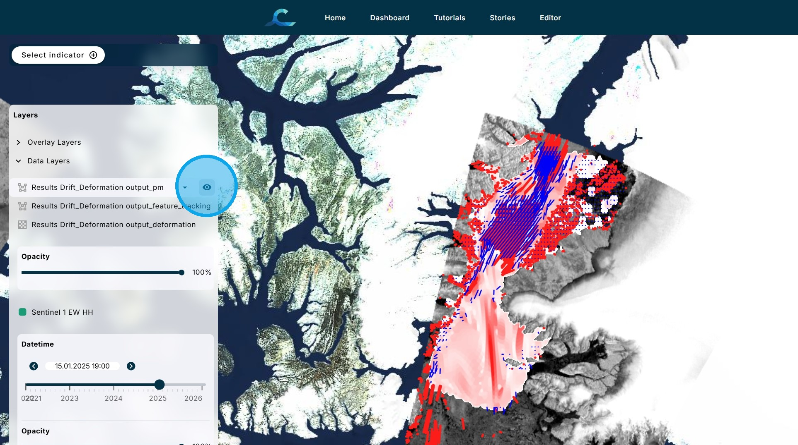
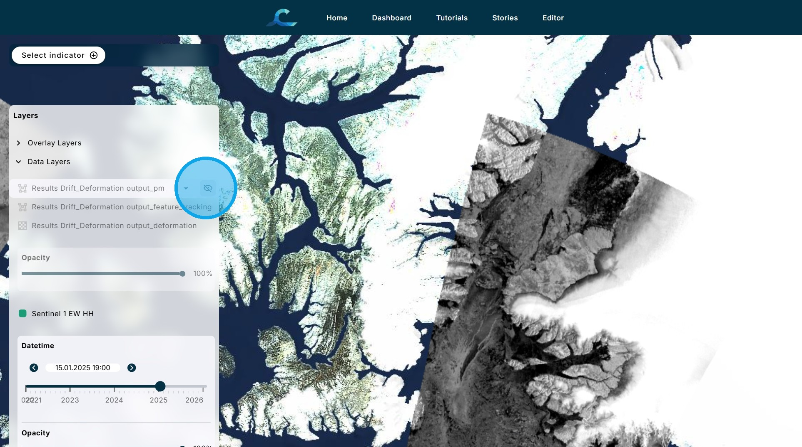
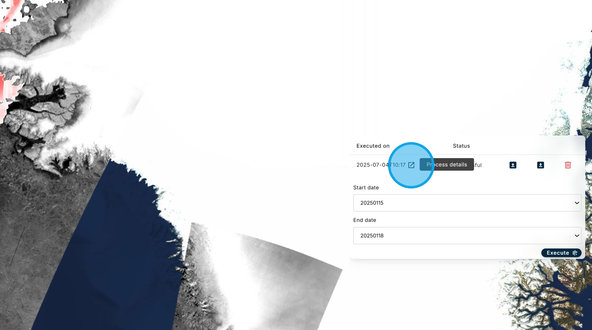
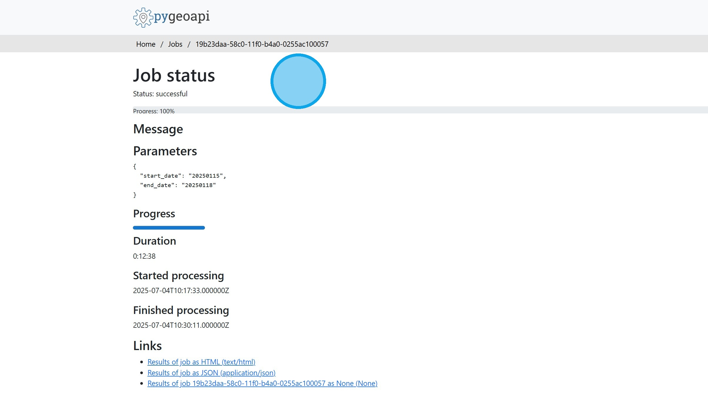

# K. Sea Ice Drift and Deformation

The Sea ice Drift and Deformation algorithm first determines sea ice drift based on the difference between two Sentinel 1 images using pattern matching and feature tracking. It then determines the deformation of the sea ice resulting from the drift.

1\. From the "Select Indicator" menu, choose the "Sea Ice Drift and Deformation" algorithm.

2\. Select two Sentinel 1 images using the "Start date" and "End date" boxes.

For the demonstration version  of the CIF Dashboard, there is only one image pair available for processing. The location is the south end of the Nares Strait between Greenland and Elsmere Island.

Click "Execute".

3\. Once the processing is finished, four layers of information are shown on the map: 1. the underlying Sentinel-1 image, 2. the feature tracking results, 3. the pattern matching results, and 4. the deformation results. All four layers are shown together here. Each layer can be turned on or off using the "eye" icon in the layers menu.

4\. This is the Sentinel 1 image layer used by the algorithm.

5\. In the Feature Tracking (FT) step, features are extracted from each image in the pair, using the OpenCV ORB algorithm. Features are then matched between the two images where possible to measure the motion of the ice over the time period spanned by the images. Matching features are connected by vectors representing the ice drift, and this forms the output of the FT step.

6\. In the Pattern Matching (PM) step, the FT output is used as a “first guess” and interpolated/extrapolated as necessary to cover the entire overlapping area between the two images in the pair. A regular grid of latitude/longitude coordinates is defined on the overlapping region, and the first guess from FT is used as a starting point for matching a template from the first image to the best pattern match in the vicinity of the first guess on the second image. This allows for calculation of ice motion across the entire overlap region, filling in the spaces between and around the FT vectors where no matching features were found.

7\. The gridded ice tracking vectors are used to estimate sea ice deformation. Using the Nansat Ice Tracking algorithm, ice motion vectors are defined for every grid point. The next step is to create a mesh of quadrilaterals based on the ice motion at each grid point. Initially the quadrilaterals are rectangular, however due to the ice motion and corresponding deformation, each of the four vertices will be displaced at the time of the second image. The deformation mesh corresponds to the displaced grid points, producing a variety of quadrilateral shapes resulting from the ice motion. This may be interpreted as a Lagrangian description of the sea ice deformation. The deformation is calculated for each polygon constituting the deformed mesh. The deformation values are calculated for each quadrilateral according to the equations given for divergence, shear, and total deformation.

8\. Since it takes some time for the results to be processed, they are stored for future access. For each stored run there is information on the date of execution and whether the run was successful or failed. There are options to load the results on the map, download the results, or delete the run.

9\. Clicking on the question mark icon beside the execution date opens the metadata for the run.

10\. Return to the Dashboard &lt;Link&gt;

Return to the Tutorial Contents &lt;Link&gt;

Continue to the next Tutorial &lt;Link&gt;