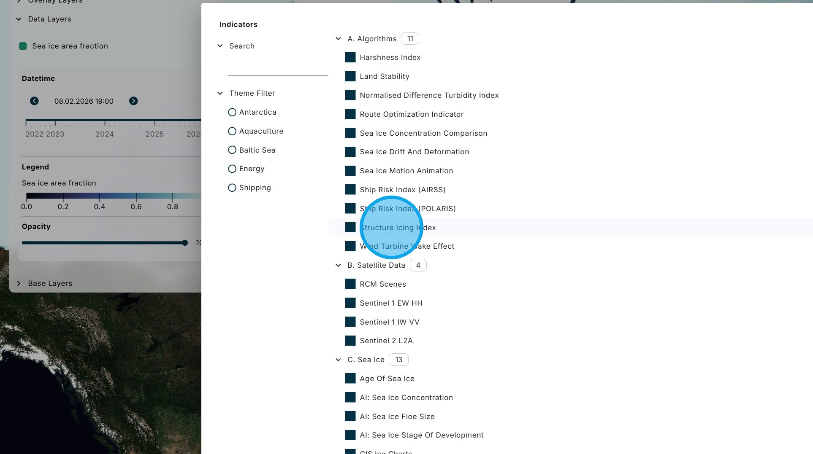
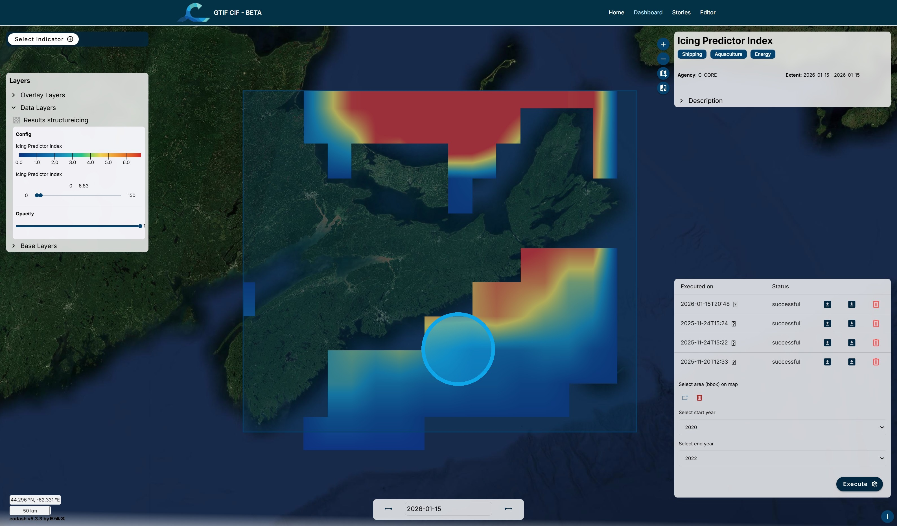

# C. Structure Icing Index

The Structure Icing Index algorithm assesses the risk to structures, such as ships and wind turbines, from freezing sea spray. The rate of ice build-up due to super-cooled sea spray freezing on contact with surfaces is a function of the air and sea surface temperatures, the wind speed, and the saltwater freezing point.

1\. From the "Select Indicator" menu, choose the "Structure Icing Index" algorithm.

2\. Using the "Select area" tool, draw a bounding box for the area of interest.

3\. Using the "Select start year" and "Select end year" boxes, choose the range of historical data for the analysis.

Click "Execute".

4\. After a period of processing, the results are displayed on the map.

5\. The slider under the legend can be used to adjust the relative colour scale to better highlight the differences within the results.

6\. Since it takes some time for the results to be processed, they are stored for future access. For each stored run there is information on the date of execution and whether the run was successful or failed. There are options to load the results on the map, download the results, or delete the run.

7\. Clicking on the question mark icon beside the execution date opens the metadata for the run.

8\. Return to the Dashboard &lt;Link&gt;

Return to the Tutorial Contents &lt;Link&gt;

Continue to the next Tutorial &lt;Link&gt;