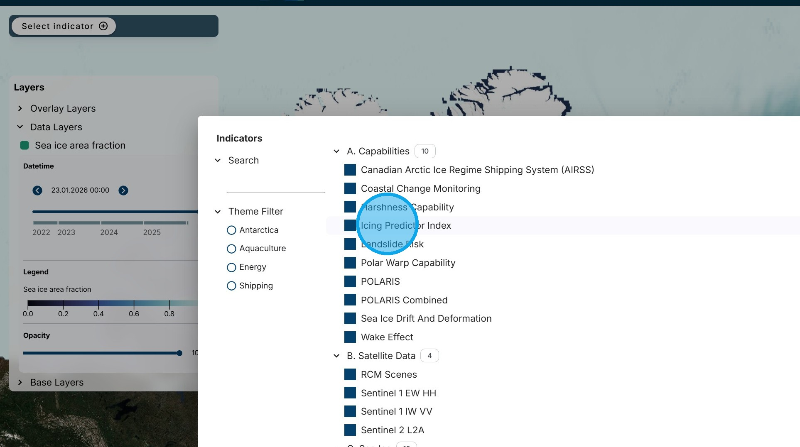
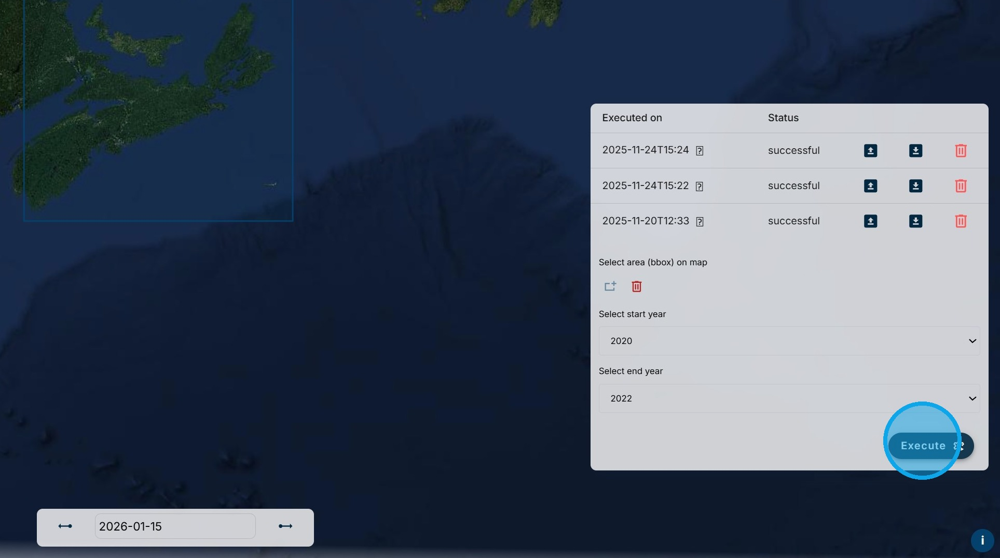
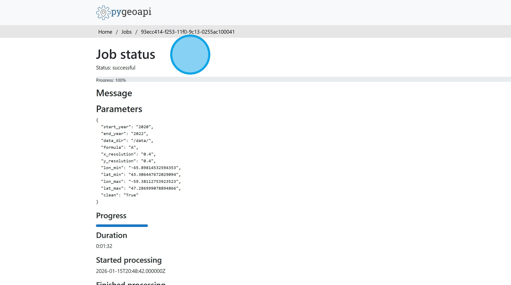

# Structure Icing Indicator

The Structure Icing indicator assesses the risk to structures, such as ships and wind turbines, from freezing sea spray. The rate of ice build-up due to super-cooled sea spray freezing on contact with surfaces is a function of the air and sea surface temperatures, the wind speed, and the saltwater freezing point.

1\. From the "Select Indicator" menu choose the Icing Prediction Index capability.

2\. Using the "Select area" tool, draw a bounding box for the area of interest. In this case, we have drawn a box around Nova Scotia.

3\. Using the "Select start year" and "Select end year" boxes, choose the time range for the analysis, thin click the "Execute" button.

4\. Click here.

5\. Using the slider under the legend, the colour scale can be adjusted to better highlight the differences in the region.

6\. Since it takes some time for the results to be processed, they are stored for future access. For each stored run there is information on the date of execution and whether the run was successful or faild. There are options to load the results on the map, download the results, or delete the run.

7\. Clicking on the question mark icon beside the execution date opens the metadata for the run.

