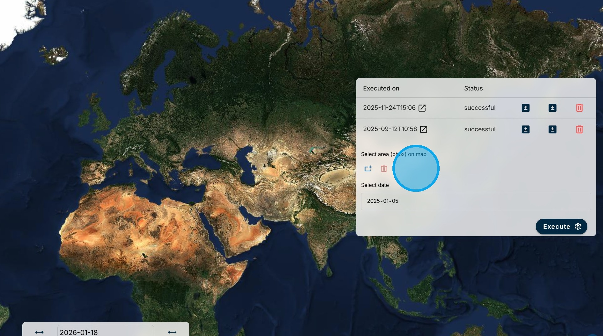
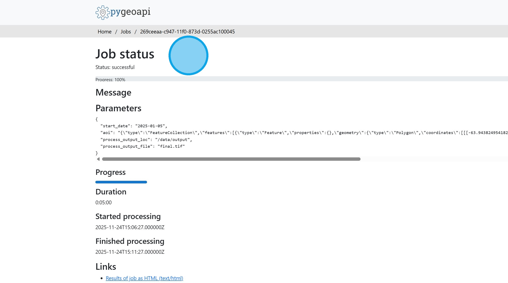

# Wake Effect

The turbulence that occurs downfield to a windfarm (the wake) can be observed by Sentinel-1. The consequence of this more turbulent air can be a reduction in wind resource in other windfarms downfield. Depending on the prevailing wind direction, newly constructed offshore wind farms can “steal” the wind resource from existing wind farms. The capability shows the wind and current direction from CMEMS model data overlayed on Sentinel-1 IW GRD SAR data.

1\. Using the "Select Indicator" menu, select the "Wake Effect" capability.

2\. Using the "Select area" tool, draw a bounding box for the region of interest. This should be a region where offshore wind turbines are located.

Using the "Select date" box choose the date for the analysis.

Then click on the "Execute" button.

3\. Since it takes some time for the results to be processed, they are stored for future access. For each stored run there is information on the date of execution and whether the run was successful or failed. There are options to load the results on the map, download the results, or delete the run.

4\. Clicking on the question mark icon beside the execution date opens the metadata for the run.

5\. The results are shown on the map. In this example, the wind turbines can be a bright spots in the SAR image. The blue arrows show the direction of the current and red arrows show the direction of the wind. The dark lines radiating from the wind turbines are in the same direction as the red arrows and therefore can be inferred to be wind wakes, rather than current wakes.

